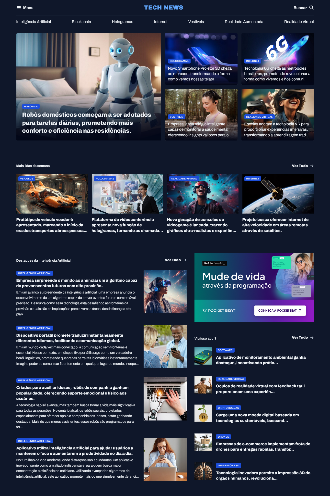

# Portal de Notícias - Rocket Seat

Um portal de notícias, focado na área de tech sendo as notícias dispostas de diversas maneiras, seções para ajudar na navegação!

## Sumário:
- [Geral](#geral)
  - [Screenshot](#screenshot)
  - [Links](#-links)
- [Processo de criação](#processo-de-craicao)
  - [Feito com:](#feito-com)
  - [Aprendizado](#aprendizado)
- [Autor](#autor)

## Geral

### Screenshot



### 🔗 Links

- Solution URL: [https://github.com/FYLIPI-2004/Portal-de-noticias](https://github.com/FYLIPI-2004/Portal-de-noticias)
- Live Site URL: [https://fylipi-2004.github.io/Portal-de-noticias/](https://fylipi-2004.github.io/Portal-de-noticias/)

## Processo de criação

### Feito com:

- Semantic HTML5 markup
- CSS custom properties
- Flexbox
- CSS Grid
- Nesting CSS

### Aprendizado

Crianção de gradiente:
```
.card {
  border-radius: 4px;
  overflow: hidden;
  position: relative;

  &::before {
    content: "";
    position: absolute;
    inset: 0;
    top: 50%;
    background: linear-gradient(180deg,
        transparent 0%,
        #020617 100%);
  }
}
```
Utilização do `figure` e do `figcaption`:

```
<figure class="card">
          

          <figcaption>
            <span class="content-tag">Hologramas</span>
            <h2 class="text-lg">
              Novo Smartphone Projetor 3D chega ao mercado, transformando a forma como vemos nossas telas!
            </h2>
          </figcaption>
        </figure>
```

## Autor

- [@FYLIPI-2004](https://github.com/FYLIPI-2004)
